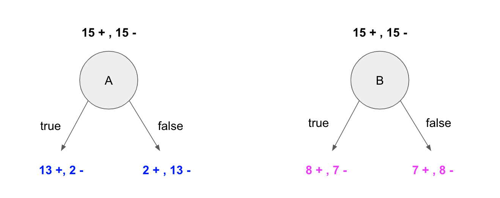

## Decision Trees

### Concepts 
You're given a dataset of **30** elements, 15 of which belong to a positive class (denoted by *`+`* ) and 15 of which do not (denoted by `-`). These elements are described by two attributes, A and B, that can each have either one of two values, true or false. 

The diagrams below show the result of splitting the dataset by attribute: the diagram on the left hand side shows that if we split by Attribute A there are 13 items of the positive class and 2 of the negative class in one branch and 2 of the positive and 13 of the negative in the other branch. The right hand side shows that if we split the data by Attribute B there are 8 items of the positive class and 7 of the negative class in one branch and 7 of the positive and 8 of the negative in the other branch.



**1) Which one of the two attributes resulted in the best split of the original data? How do you select the best attribute to split a tree at each node?** _(Hint: Mention splitting criteria)_


```python
# Your written answer here 
```

### Decision Trees for Regression 

In this section, you will use decision trees to fit a regression model to the Combined Cycle Power Plant dataset. 

This dataset is from the UCI ML Dataset Repository, and has been included in the `data` folder of this repository as an Excel `.xlsx` file, `Folds5x2_pp.xlsx`. 

The features of this dataset consist of hourly average ambient variables taken from various sensors located around a power plant that record the ambient variables every second.  
- Temperature (AT) 
- Ambient Pressure (AP) 
- Relative Humidity (RH)
- Exhaust Vacuum (V) 

The target to predict is the net hourly electrical energy output (PE). 

The features and target variables are not normalized.

In the cells below, we import `pandas` and `numpy` for you, and we load the data into a pandas DataFrame. We also include code to inspect the first five rows and get the shape of the DataFrame.


```python
import pandas as pd 
import numpy as np 

# Load the data
filename = 'data/Folds5x2_pp.xlsx'
df = pd.read_excel(filename)
```


```python
# Inspect the first five rows of the dataframe
df.head()
```


```python
# Get the shape of the dataframe 
df.shape
```

Before fitting any models, you need to create training and testing splits for the data.

Below, we split the data into features and target ('PE') for you. 


```python
X = df[df.columns.difference(['PE'])]
y = df['PE']
```

**2) Split the data into training and test sets. Create training and test sets with `test_size=0.5` and `random_state=1`.** 


```python
# Your code here. Replace None with appropriate code. 

X_train, X_test, y_train, y_test = None
```

**3) Fit a vanilla decision tree regression model with scikit-learn to the training data.** Set `random_state = 1` for reproducibility. **Evaluate the model on the test data.** 


```python
# Your code here 
```

**4) Obtain the mean squared error, mean absolute error, and coefficient of determination (r2 score) of the predictions on the test set.** _Hint: Look at the `sklearn.metrics` module._


```python
# Your code here. Replace None with appropriate code. 

print("Mean Squared Error:", None)
print("Mean Absolute Error:", None)
print("R-squared:", None)
```

Hint: MSE = 22.21041691053512

### Hyperparameter Tuning of Decision Trees for Regression

For this next section feel free to refer to the scikit learn documentation on [decision tree regressors](https://scikit-learn.org/stable/modules/generated/sklearn.tree.DecisionTreeRegressor.html)

**5) Add hyperparameters to a a new decision tree and fit it to our training data and evaluate the model with the test data.**


```python
# Your code here 
```

**6) Obtain the mean squared error, mean absolute error, and coefficient of determination (r2 score) of the predictions on the test set. Did this improve your previous model? (It's ok if it didn't)**


```python
# Your answer and explanation here
```
